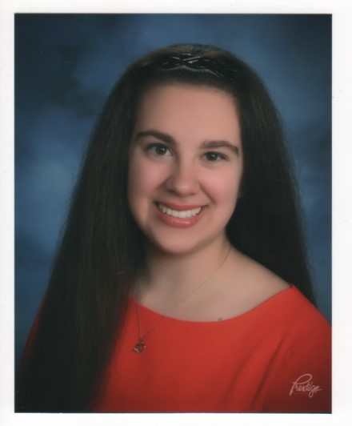

Graduate student at Columbia University Mailman School of Public Health pursuing a Master of Science in Biostatistics (Theory and Methods track) 

## Research

I have been working with Dr. Laura Rozek, professor of Epidemiology, and Dr. Sartor, professor of Biostatistics at the University of Michigan on their cancer research.  I analyzed previously collected data for the Greek Oral Dysplasia Study.  This study is a longitudinal study looking at the progression of oral epithelial dysplasias and if they lead to oral squamous cell carcinomas in a cohort of patients in Greece. 

During my internship at John Wiley & Sons, Inc., [I analyzed impact factor and submission data](https://onlinelibrary.wiley.com/doi/abs/10.1002/leap.1285).

## About

I received a BS in statistics from the University of Michigan in 2020.  I am currently a student at Columbia University Mailman School of Public Health pursuing a MS in Biostatistics.

In 2016 I founded the Girl Scouts at the University of Michigan Club.  I served as President from 2016-2020 working closely with the Girl Scouts Heart of Michigan council.  I am a Girl Scout Gold Award Recipient for a project I implemented about Noise Induced Hearing Loss Prevention.

## Contact Information

Email: tessas@umich.edu

[LinkedIn](https://www.linkedin.com/in/tessasenders/)

